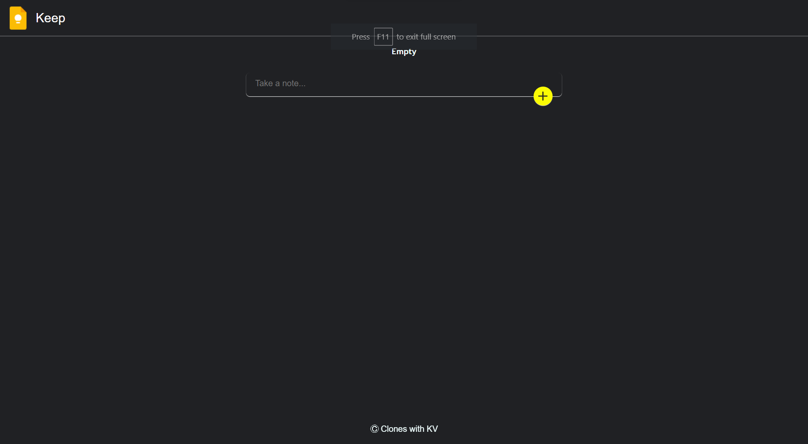

# google-keep-clone
React KeepClone is a feature-rich, user-friendly note-taking web application built using the powerful React.js library. Inspired by the popular Google Keep, this application offers a seamless and intuitive interface for organizing your thoughts, ideas, to-do lists, and important reminders.
# React KeepClone - Google Keep Clone

React KeepClone is a web application built using React.js that serves as a clone of Google Keep, a note-taking app. It offers a user-friendly interface for creating and managing notes, to-do lists, reminders, and more.

## Features

- Create, edit, and delete notes.
- Organize notes with colors and categories.
- Interactive checklists and to-do lists.
- Set reminders and alarms for notes.
- Responsive design for various devices.
- Drag-and-drop functionality for note organization.
- Powerful search functionality.
- Collaborative sharing and real-time collaboration.
- Secure and private data storage.

## Demo

You can access the live demo of React KeepClone [here](https://your-demo-link.com).

## Installation

1. Clone this repository: `git clone https://github.com/Luci07Devil/google-keep-clone.git`
2. Navigate to the project directory: `cd react-keepclone`
3. Install dependencies: `npm install`
4. Start the development server: `npm start`
5. Open your browser and go to: `http://localhost:3000`

## Usage

- Create a new note by clicking the "New Note" button.
- Delete an existing note

## Technologies Used

- React.js: Frontend library for building user interfaces.
- react-icons

## Contributing

Contributions are welcome! If you'd like to contribute to React KeepClone, please follow these steps:

1. Fork the repository.
2. Create a new branch for your feature: `git checkout -b feature-name`
3. Make your changes and commit them: `git commit -m "Add your message"`
4. Push your changes to your fork: `git push origin feature-name`
5. Create a pull request describing your changes.

## License

This project is licensed under the [MIT License](LICENSE).

## Contact

For any inquiries or suggestions, feel free to reach out to us at pkbvasan99@outlook.com

